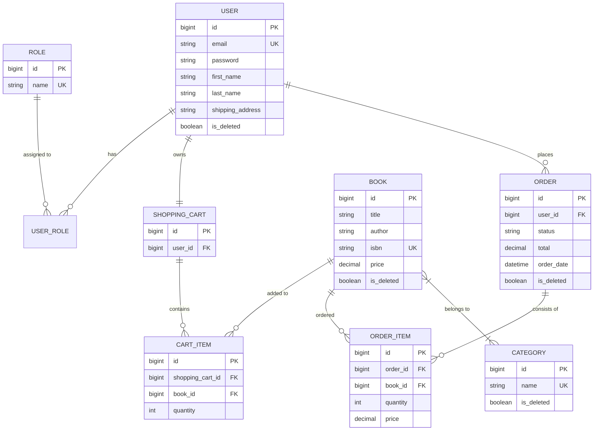
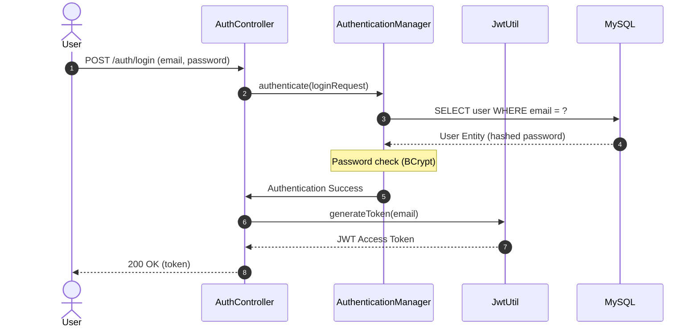
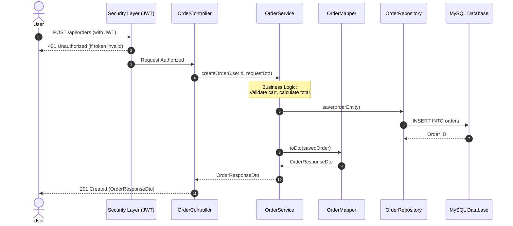
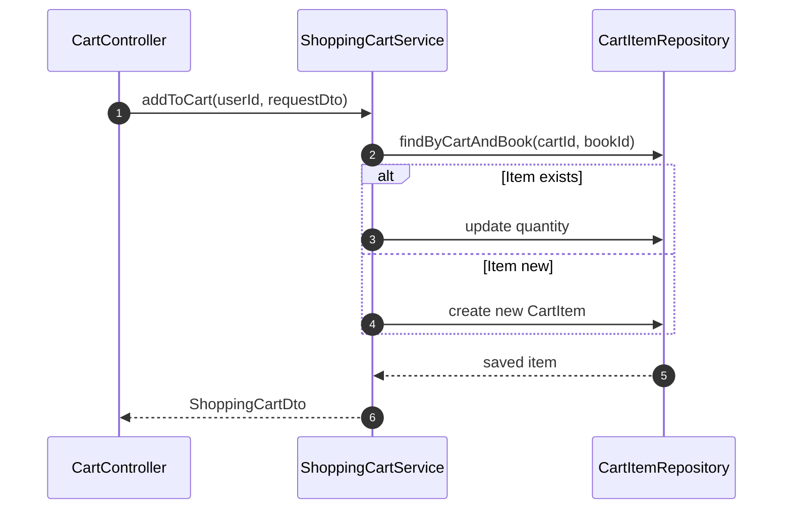
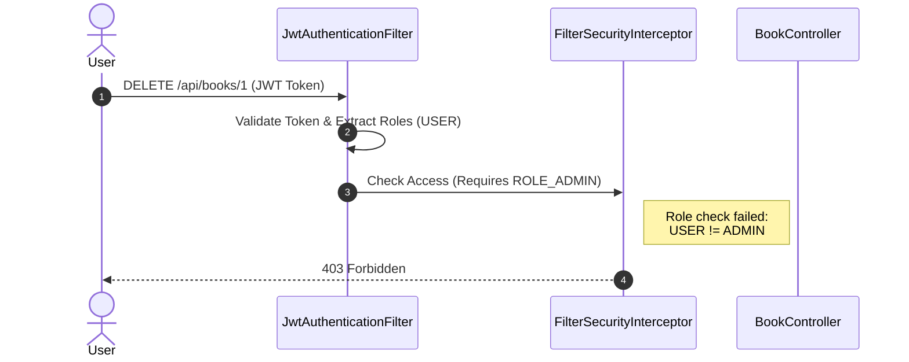
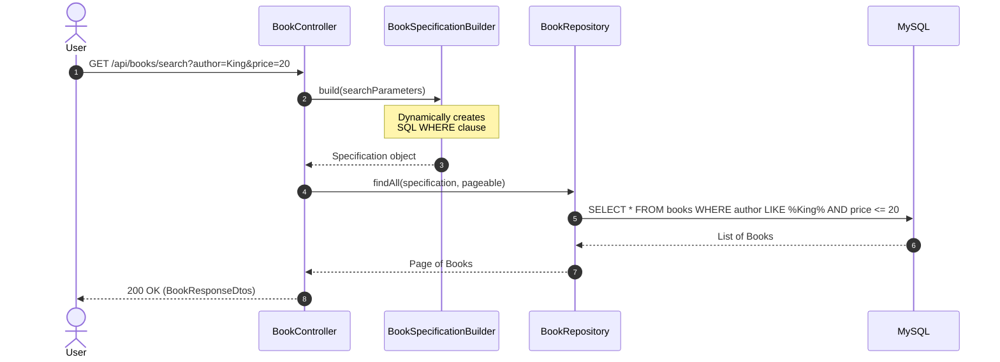

# 📚 Book store API

## 🌟 Overview

**Bookstore app** is a comprehensive RESTful API designed to power a modern digital library or e-commerce platform.
Built with the **Spring Boot** ecosystem, it provides a seamless experience for browsing books, managing categories, and
handling user orders with security and scalability in mind.

---

## 🏗️ System Architecture

Below is the entity-relationship diagram representing the core data model and connections of the book store app:



---

## 🔐 Authentication Flow (Login & JWT)



---

## 🔄 Request Flow Diagram (Create Order)



---

## 🛒 Add Item to Shopping Cart (Business Validation)



---

## 🛡️ Role-Based Access Control (Admin vs User)



---

## 🔍 Book Search & Filtering Flow



---

## 📺 Project Demo

See the API in action and a brief code walkthrough:
👉 **[Watch the Loom Video Demo](https://www.google.com/search?q=INSERT_YOUR_LOOM_LINK_HERE)**

---

## 🛠 Technology Stack & Tools

The project is built using a modern, industry-standard stack to ensure security, scalability, and ease of maintenance:

| Category            | Tools & Technologies                                                                                                                                          | Purpose                                                   |
|:--------------------|:--------------------------------------------------------------------------------------------------------------------------------------------------------------|:----------------------------------------------------------|
| **Backend Core**    |            | Core framework and runtime environment.                   |
| **Security**        |   | Authentication and role-based authorization (RBAC).       |
| **Persistence**     |                                             | Production and in-memory testing databases.               |
| **DB Migrations**   |                                                                                     | Version control for database schema changes.              |
| **Mapping & Utils** |                                                  | Reducing boilerplate code for DTO mapping and POJOs.      |
| **API Docs**        |                                                                                           | Interactive API documentation and testing via Swagger UI. |
| **Testing**         |                                | Unit and integration testing with isolated environments.  |
| **Deployment**      |             | Containerization and multi-container orchestration.       |

---

## 🚀 Key Features

* **Inventory Management:** Full CRUD for books and categories with advanced filtering.
* **Security:** Role-based access control (RBAC).
* `ADMIN`: Full control over the catalog.
* `USER`: Search books and manage personal shopping cart/orders.


* **Shopping Cart:** Real-time management of selected items.
* **Order System:** Automated checkout process with status tracking.

---

## ⚙️ Installation & Setup

### Required Software

* Java JDK (17 or 22)
* Maven
* Docker & Docker Compose

### Step-by-Step Instructions

1. **Clone the repository:**

```bash
https://github.com/Volodymyr-Mykychak/bookstore.git
cd bookstore

```

2. **Configure Environment:**

```bash
cp .env.template .env
# Edit .env file to match your local configuration (DB credentials, etc.)

```

3. **Build & Run via Docker (Recommended):**

```bash
mvn clean package -DskipTests
docker-compose up --build

```

```bash
docker compose down -v
```

4. **Manual Run (Alternative):**

```bash
mvn spring-boot:run

```

---

## 📖 Usage & API Documentation

Once the application is running, you can explore the endpoints via Swagger UI:
🔗 **http://localhost:8080/api/swagger-ui.html**

**Default Credentials (Admin):**

* **Email:** `admin@example.com`
* **Password:** `12345678`

** [Admin Authentication](http://localhost:8080/api/swagger-ui/index.html#/Authentication/login) **

```json
{
  "email": "admin@example.com",
  "password": "12345678"
}

```

---

### 📝 API Request Examples

#### 1. [User Registration](http://localhost:8080/api/swagger-ui/index.html#/Authentication/registerUser)

Use this payload to create a new account.

```json
{
  "email": "user@example.com",
  "password": "Password123",
  "repeatPassword": "Password123",
  "firstName": "John",
  "lastName": "Doe",
  "shippingAddress": "123 Bookstore Street, New York, NY"
}

```

#### 2. [User Authentication](http://localhost:8080/api/swagger-ui/index.html#/Authentication/login)

Use these credentials to obtain your JWT access token.

```json
{
  "email": "user@example.com",
  "password": "Password123"
}

```

#### 3. [Adding a New Category](http://localhost:8080/api/swagger-ui/index.html#/Categories/createCategory)

```json
{
  "name": "Programming",
  "description": "Books about software development and languages"
}
```

#### 4. [Adding a New Book](http://localhost:8080/api/swagger-ui/index.html#/Books/createBook)

```json
{
  "title": "Effective Java",
  "author": "Joshua Bloch",
  "isbn": "9780134685991",
  "price": 45.00,
  "description": "A comprehensive guide to best practices for the Java platform.",
  "coverImage": "https://example.com/images/effective-java.jpg",
  "quantity": 15,
  "categoryIds": [
    1
  ]
}

```

####  4.1 [Get books](http://localhost:8080/api/swagger-ui/index.html#/Books/getAllBooks)
####  4.2 [Get categories](http://localhost:8080/api/swagger-ui/index.html#/Categories/getAllCategories)
####  4.3 [Get search](http://localhost:8080/api/swagger-ui/index.html#/Books/searchBooks)

#### 5. [Post cart](http://localhost:8080/api/swagger-ui/index.html#/Shopping%20Cart/addBook)

```json
{
  "bookId": 1,
  "quantity": 2
}
```

#### 6. [Post orders](http://localhost:8080/api/swagger-ui/index.html#/order-controller/createOrder)

```json
{
  "shippingAddress": "32 Mykoly Zakrevskoho St, Kyiv, 02222, Ukraine"
}
```


---

## 🧪 Testing

The project ensures reliability through unit and integration tests.
To run the test suite, use:

```bash
mvn test  

```

---

## 💡 Challenges Faced

During the development of this API, I focused on solving several key architectural problems:

* **Data Integrity:** Implementing **Soft Delete** logic using Hibernate annotations to preserve historical data.
* **Performance:** Optimizing database queries for book searching and filtering to ensure fast response times.
* **Security:** Configuring a stateless **JWT-based authentication** flow that integrates seamlessly with Spring
  Security.

---

### 🛠 Troubleshooting & Clean Start

If you encounter issues with the database (e.g., Liquibase checksum errors) or want to reset the application state
completely, follow these steps to ensure a **clean start**:

1. **Stop and remove all containers, networks, and volumes:**

> The `-v` flag is crucial here as it deletes the persistent MySQL data, allowing Liquibase to re-run all migrations on
> a fresh database.

```bash
docker compose down -v

```

2. **Rebuild the application and start the containers:**

```bash
mvn clean package -DskipTests
docker compose up --build

```

---

## 📊 Database Management

Since the application runs in a Docker container, you can access the **MySQL** database directly via terminal to verify
data persistence and user roles.

### Accessing the Database

To log into the MySQL terminal inside the running container, use the following command:

```bash
docker exec -it bookstore-mysqldb-1 mysql -u root -ppassword bookstore

```

*(Note: Replace `password` with the value from your `.env` file if it differs).*

### Useful SQL Queries

Once inside the MySQL shell, you can use these queries to verify the system state:

* **Check Registered Users:**

```sql
SELECT id, email, first_name FROM users;

```

* **Verify User Roles:**

```sql
SELECT u.email, r.name 
FROM users u 
JOIN users_roles ur ON u.id = ur.user_id 
JOIN roles r ON ur.role_id = r.id;

```

* **Promote User to Admin:**

```sql
UPDATE users_roles SET role_id = 1 WHERE user_id = 2;

```

---

## 🤝 Acknowledgements

* **Mate Academy** mentors and students for the technical support.
* The **Spring Community** for the excellent documentation.

---

**Developed by:** [Your Name]
*Feel free to reach out for collaboration or questions!*

---